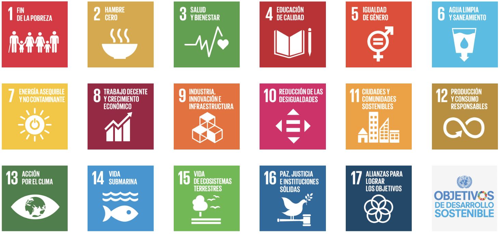

# Introducción a la Sostenibilidad

La sostenibilidad consiste en intentar satisfacer las necesidades humanas usando de forma responsable los recursos disponibles para 
mantener un cierto equilibrio entre el bienestar del planeta y el bienestar social. Tiene tres dimensiones:

- **Ambiental:** Se enfoca en la conservación de los ecosistemas y la biodiversidad
- **Social:** Busca un crecimiento que sea financieramente viable y que no genere un impacto negativo en el medio ambiente o la sociedad
- **Economico:** Consiste en asegurar la equidad, la justicia social y la calidad de vida para todas las personas

Segun un integrante de la ONU llamado Gro Harlem Brundtland: 
> La sostenibilidad es el desarrollo que satisface las necesidades del presente sin comprometer 
la capacidad de las futuras generaciones para satisfacer sus propias necesidades.

## Objetivos de Desarrollo Sostenible relacionados con la informática
He elegido estos tres por que pienso que se puede enfocar a crear aplicaciones.

|ODS 1            |ODS 2                           |ODS 3              |
|-----------------|--------------------------------|-------------------|
|Salud y bienestar|Produccion y consumo responsable|Accion por el clima|

La siguiente imagen muestra todos los ODS

Tareas para ser más sostenible en informática

* [ ] 
* [ ] 
* [ ] 
* [ ] 
